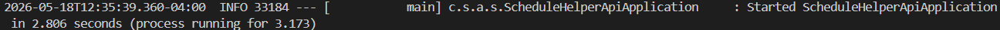
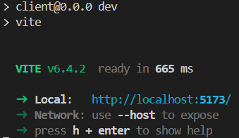

# ScheduleHelper


## Table of Contents
- [Description](#description)
- [Tech Stack](#tech-stack)
- [Setup](#setup)
- [Usage](#usage)
- [Feature Roadmap](#feature-roadmap)
- [Database Schema](#database-schema)
- [Project Structure](#project-structure)

## Description
This is a personal project built out of a desire for a helper tool to streamline team creation based on previous performance metrics. ScheduleHelper uses metrics such as scheduling frequency, calculated skill (based on previously scored shifts), and interpersonal chemistry (derived from shift performance when other members are present in the team).

A secondary planned feature is suggesting changes after call-offs. Based on the previous metrics, robust teams will be created with contingency plans for who should be called in in the event that an original member calls off, while maintaining the predicted team performance.

## Tech Stack
- **Frontend:** React + Vite
- **Backend:** Java Spring Boot
- **Database:** PostgreSQL
- **Dependencies:** see [`pom.xml`](server/pom.xml) and [`client/package.json`](client/package.json)

## Setup

### Backend
1. Ensure Java 17+ is installed.
2. Configure the database connection:
```bash
cp server/src/main/resources/application.properties server/src/main/resources/application-local.properties
```
Then edit `application-local.properties` with your local database credentials.

### Frontend
1. Install dependencies:
```bash
cd client
npm install
```

## Usage

### Backend
```bash
cd server
./mvnw spring-boot:run
```

#### Expected Output


### Frontend
```bash
cd client
npm run dev
```

#### Expected Output


## Feature Roadmap
1. **Shift Logging** - Shifts with their times, assigned employees, and performance outcomes can be recorded and displayed.

2. **Performance Analysis** - Performance across shifts is recorded per employee. Skill will be calculated (and optionally assigned) for each employee in their assigned position.

3. **Chemistry Analysis** - Based on individual skill and team performance, chemistry between employees will be calculated based on how team performance is affected.

4. **Attendance** - Previous attendance and call-off likelihood will be calculated and factored into scheduling, ensuring equitable scheduling while factoring in attendance history, with employees who have lower attendance reliability receiving fewer future assignments.

5. **Call-off Suggestion** - Replacement employees are suggested for each position in case of a call-off, with the chemistry and skill requirements of replacements having an inverse relationship with the reliability of the original employee.

## Database Schema
The schema is defined in [`server/db/schedulehelper.sql`](server/db/schedulehelper.sql). The initial shift logging schema consists of four tables:
- **employee** - Stores individual employee records (id, first_name, last_name).
- **shift** - Represents a scheduled shift with timezone-aware start and end times.
- **role_type** - Lookup table of possible roles an employee can fill during a shift.
- **shift_role** - Junction table linking an employee and a role to a specific shift. Records a per-shift performance score (0–100) for use in future skill and chemistry calculations.

## Project Structure
```
ScheduleHelper/
├── client/                     # React + Vite frontend
│   └── package.json            # Frontend dependencies
├── docs/                       # Screenshots and documentation
├── public/                     # Reserved for Vite
└── server/                     # Java Spring Boot backend
    ├── db/
    │   └── schedulehelper.sql      # Database schema
    ├── src/
    │   ├── main/
    │   │   ├── java/com/schedulehelper/api/schedulehelperapi/
    │   │   │   └── ScheduleHelperApiApplication.java
    │   │   └── resources/
    │   │       └── application.properties
    │   └── test/
    │       └── java/com/schedulehelper/api/schedulehelperapi/
    │           └── ScheduleHelperApiApplicationTests.java
    └── pom.xml
```

## Project Status
Currently a summer project focused on building a tool I've personally felt a need for. The goal is to keep it organized and well-documented as part of a portfolio.